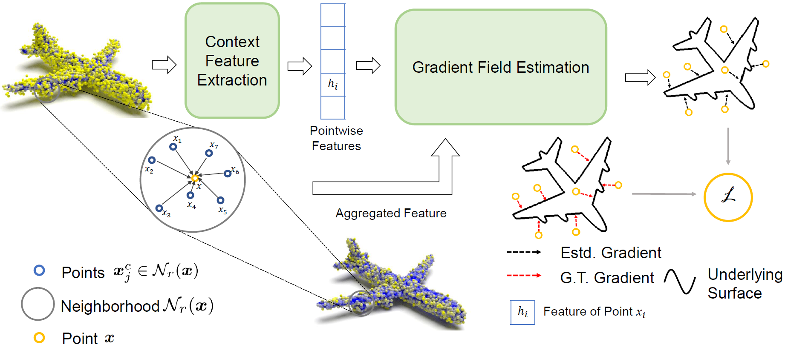

# Deep Point Set Resampling via Gradient Fields



[Paper](https://arxiv.org/abs/2111.02045) [code](https://github.com/ChenhLiwnl/deep-rs)

The official code repository for our TPAMI paper 'Deep Point Set Resampling via Gradient Fields'.


## Installation

You can install via conda environment .yaml file

```bash
conda env create -f environment.yml
conda activate deeprs
```

## Dataset

to release soon

## Training and Testing

To train or test your model, you should first edit the corresponding config file according to the comments (fill in the file directory). Then, you can simply run

```bash
## Train a network for denoising
python -m scripts.train_denoise --config ./configs/denoise.yml
## Train a network for upsampling
python -m scripts.train_upsample --config ./configs/ups.yml
```

for training, and run 

```bash
## Save your denoising results
python -m scripts.save_denoised --config ./configs/denoise.yml [--ckpt]
## Save your upsampling results
python -m scripts.train_upsample --config ./configs/ups.yml [--ckpt_model] [--ckpt_gen]
```

for testing.

## Evaluation

You can run 

```bash
python -m scripts.evaluate --config ./configs/denoise.yml
python -m scripts.evaluate_upsample --config ./configs/ups.yml
```

to evaluate your results

## Citation

If you feel this work helpful, please cite

```
@ARTICLE{9775211,
  author={Chen, Haolan and Du, Bi'an and Luo, Shitong and Hu, Wei},
  journal={IEEE Transactions on Pattern Analysis and Machine Intelligence}, 
  title={Deep Point Set Resampling via Gradient Fields}, 
  year={2022},
  volume={},
  number={},
  pages={1-1},
  doi={10.1109/TPAMI.2022.3175183}}
```

and contact chenhl99@pku.edu.cn for any question.